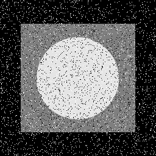

# Image Processing


simple projects using opencv with python.


## python

This project is written in Python version 3.10.8

I have used the [opencv](https://pypi.org/project/opencv-python/) library for this project


### **How to install**
---

Run following commands:
 ```
pip install -r requierments.txt
 ```
### **My Projects**
 ---

**First**   :   **Test 2D Filters**


### **How to Run**
excecute this command in terminal:
 ```
 p1\main.py
  ```
   

input
---


---

### **result**
1-edge detection filter


---


---

2-Sharpening filter


---


---

3-Emboss filter


---


---
4-Identity filter

---


---

5-my filter

---


---
**Second**   :   **Reduce noise by using Median filter**


### **How to Run**
excecute this command in terminal:
 ```
 p3\main.py
  ```
### **input**   

### **result**
---


---

### **input**   

### **result**
---


---

### **input**   

### **result**
---


---

### **input**   

### **result**
---


---

### **input**   

### **result**
---


---

### **input**   

### **result**
---


---

**Theard**   :   **Histogram Equalization**


### **How to Run**
excecute this command in terminal:
 ```
 p4\main.py
  ```

### **result**
---

### **input**   

### **result**
---


---

### **input**   

### **result**
---


---

### **input**   

### **result**  by using cv2.equalizeHist()
---


---
### **result**  by using cv2.createCLAHE()
---


---